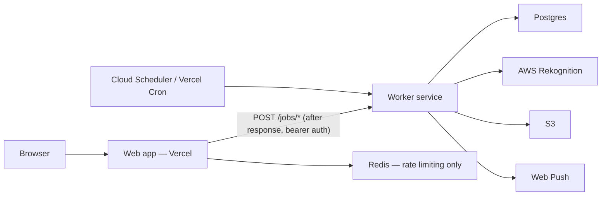

# ClassSync — Multi-Tenant School ERP

A multi-tenant, RBAC-secured School ERP platform built with Next.js 16, Prisma, PostgreSQL RLS, Auth.js, a standalone Hono worker service, and multi-provider payments.

## Features

- **Multi-tenancy** with PostgreSQL Row-Level Security (RLS) backstop
- **Roles:** System Admin, School Admin, Teacher, Staff, Parent (students are records, not accounts)
- **Employee management** with job types (teaching, transport, security, maintenance, leadership, and more)
- **Conflict-free class scheduler** (CSP backtracking with setup gatekeeper wizard + swap requests)
- **Teacher & staff attendance** with geofence + face recognition queue + retry/escalation flow
- **Working calendar** for school holidays and working-day rules
- **Payroll & payouts** (monthly runs, salary slips, RazorpayX payouts when configured)
- **Parent portal** for documents, leave requests, and fee payments
- **Multi-provider fee payments** — Razorpay, PhonePe, PayPal, Stripe (per-tenant encrypted keys)
- **PWA** with service worker, offline fallback, background sync for attendance
- **Standalone worker service** (HTTP, not a queue consumer) for face verification, notifications, document AI, scheduling, and payroll jobs — deployable independently of the web app on Cloud Run or a second Vercel project
- **Campus map picker** via Google Maps (optional; used in Admin → Settings)

## Tech Stack

- Next.js 16 (App Router) + TypeScript + Tailwind v4
- Auth.js v5 (JWT sessions with tenantId, role, permissions)
- Prisma + PostgreSQL with RLS
- Hono worker service (HTTP) — runs standalone on Node, deployable to Cloud Run or Vercel
- Redis (rate limiting/idempotency in the web app only — no longer a job queue)
- AWS S3 + Rekognition (cloud face recognition for attendance)
- Razorpay / PhonePe / PayPal / Stripe (per-tenant fee providers)
- RazorpayX (optional staff salary payouts)
- Google Maps (campus geofence location picker)
- Web Push (VAPID)

## Getting Started

### Option A: Docker (recommended for local dev)

Starts PostgreSQL, Redis, and MinIO (S3-compatible storage):

```bash
docker compose up -d
cp .env.docker .env   # or merge into your existing .env

npm install
npm run db:generate
npm run db:push
npm run db:rls
npm run db:seed

npm run dev           # web app on :3000
npm run worker        # worker service on :3001 (separate terminal)
```

Docker services:

| Service  | URL / Port                          |
|----------|-------------------------------------|
| Postgres | `localhost:5432` (user/pass: `postgres`/`postgres`, db: `classsync`) |
| Redis    | `localhost:6379`                    |
| MinIO    | API `:9000`, Console `:9001` (minioadmin/minioadmin) |

### Option B: Manual setup

#### Prerequisites

- Node.js 20+
- PostgreSQL 15+
- Redis 7+

```bash
cp .env.example .env
# Edit DATABASE_URL, REDIS_URL, AUTH_SECRET, ENCRYPTION_KEY

npm install
npm run db:generate
npm run db:push
npm run db:rls    # Apply RLS policies
npm run db:seed   # Seed demo data + permissions
```

### Development

```bash
npm run dev       # Next.js app on :3000
npm run worker    # Worker service on :3001 (separate terminal)
```

### Demo Accounts (after seed)

| Role | Email | Password |
|------|-------|----------|
| System Admin | admin@classsync.app | admin123 |
| School Admin | schooladmin@demo.com | school123 |
| Teacher | teacher@demo.com | teacher123 |
| Staff (Driver) | driver@demo.com | staff123 |
| Staff (Security) | security@demo.com | staff123 |
| Staff (Cleaner) | cleaner@demo.com | staff123 |
| Parent | parent@demo.com | parent123 |

### Testing

```bash
npm test          # Unit tests (geofence, scheduler, encryption, attendance FSM, employees)
```

Integration tests for RLS tenant isolation run when `DATABASE_URL` is set.

## Environment Variables

Copy from `.env.example` (manual) or `.env.docker` (Docker Compose + MinIO + mock face provider).

| Variable | Required | Purpose |
|----------|----------|---------|
| `DATABASE_URL` | Yes (web + worker) | PostgreSQL connection string |
| `REDIS_URL` | Yes (web only) | Rate limiting / idempotency — no longer a job queue |
| `WORKER_URL` | Yes (web only) | Base URL of the deployed worker service (e.g. `https://classsync-worker-xyz.a.run.app`) |
| `WORKER_SECRET` | Yes (web + worker) | Shared bearer token — must match on both deployments |
| `WORKER_ROLE` | Worker only | Set to `worker` on the worker deployment (`npm run worker` sets this automatically) |
| `AUTH_SECRET` | Web only | Auth.js session secret |
| `ENCRYPTION_KEY` | Yes (web + worker) | 64-char hex (32 bytes) for encrypting payment/payout secrets |
| `AWS_ACCESS_KEY_ID` / `AWS_SECRET_ACCESS_KEY` | Yes (web + worker) | S3 + Rekognition — required explicitly; neither Vercel nor GCP has an EC2-style instance role |
| `AWS_REGION` | Yes for AWS | e.g. `ap-south-1` |
| `S3_BUCKET` | Yes (web + worker) | Upload bucket name |
| `S3_ENDPOINT` | Local only | e.g. `http://localhost:9000` for MinIO |
| `FACE_PROVIDER` | No | `aws` (default) or `mock` for local dev — `mock` only works if enroll and verify run in the same process, so keep it `aws` once web and worker are split |
| `RAZORPAY_PLATFORM_KEY` | No | Optional platform-level Razorpay key |
| `VAPID_PUBLIC_KEY` / `VAPID_PRIVATE_KEY` / `VAPID_SUBJECT` | Worker only | Web Push credentials |
| `AZURE_END_POINT` / `AZURE_OPEN_AI_API_KEY` / `AZURE_DEPLOYMENT_NAME` | Worker only | Document AI extraction |
| `NEXT_PUBLIC_APP_URL` / `NEXTAUTH_URL` | Web only | App URL (e.g. `http://localhost:3000`) |
| `NEXT_PUBLIC_GOOGLE_MAPS_API_KEY` | Optional | Campus location map picker |
| `NEXT_PUBLIC_GOOGLE_MAPS_MAP_ID` | Optional | Google Maps Map ID for the picker |

**Per-school secrets (not in `.env`):** fee provider keys (Razorpay, PhonePe, PayPal, Stripe) and RazorpayX payout credentials are configured in **Admin → Settings**. Use test keys (e.g. `rzp_test_*`) for local demos.

## Face Recognition (AWS Rekognition)

Teacher and staff attendance uses **geofence + face verification**. Faces are enrolled once, then verified asynchronously by the standalone worker service via **AWS Rekognition** (fully managed cloud API).

### How it works

```
Browser (camera + GPS)
  → submit attendance action (geofence check)
  → captured frame uploaded to S3
  → web app dispatches POST /jobs/face-verify to the worker (deferred via Next.js after())
  → worker downloads the frame and calls AWS Rekognition SearchFacesByImage
  → attendance marked PRESENT / FAILED / ESCALATED
```

| Step | Where |
|------|--------|
| Enroll face | `/teacher/attendance` or staff attendance panel |
| Mark attendance | Same page — camera + location required |
| Verify (async) | Worker service (`npm run worker` locally; Cloud Run/Vercel in production) |
| Admin review | `/admin/attendance` (escalated cases) |

**Important:** The worker must be reachable at `WORKER_URL` for face verification to complete. Enrollment and attendance submission happen in the web app; matching runs in the worker. Face verify jobs are dispatched over HTTP with a shared `WORKER_SECRET`, not a job queue — Redis is only used for rate limiting now.

### Environment variables

| Variable | Values | Purpose |
|----------|--------|---------|
| `FACE_PROVIDER` | `aws` (default) | Use AWS Rekognition |
| `FACE_PROVIDER` | `mock` | In-memory mock for local dev without AWS |
| `AWS_REGION` | e.g. `ap-south-1` | Rekognition region (Mumbai recommended for India) |
| `AWS_ACCESS_KEY_ID` | optional on EC2 | IAM user keys (if not using instance role) |
| `AWS_SECRET_ACCESS_KEY` | optional on EC2 | IAM user secret |

`.env.docker` sets `FACE_PROVIDER=mock` so local Docker dev works without Rekognition. For production, use `FACE_PROVIDER=aws` on **both** the web app and the worker — `mock` keeps state in memory per-process, so it breaks once enrollment (web) and verification (worker) run in separate deployments.

### Local development (mock provider)

When using Docker Compose + MinIO, copy `.env.docker` which includes:

```env
FACE_PROVIDER=mock
```

This enables the full attendance UI flow without AWS credentials. Verification uses an in-memory mock — not suitable for demo/production.

### Production (AWS Rekognition)

Both the web app and the worker call AWS SDKs (Rekognition, S3), and neither Vercel nor GCP offers an EC2-style instance role, so use an **IAM user with access keys** set on both deployments:

```env
FACE_PROVIDER=aws
AWS_REGION=ap-south-1
AWS_ACCESS_KEY_ID=your-key
AWS_SECRET_ACCESS_KEY=your-secret
```

Ensure the IAM user has `rekognition:CreateCollection`, `rekognition:IndexFaces`, and `rekognition:SearchFacesByImage` permissions (plus S3 read/write for the uploads bucket).

The face collection (`classsync-faces`) is **created automatically** on first enrollment.

Note: this replaces the EC2-instance-role option. Cloud Run and Vercel are not AWS, so there is no equivalent "instance role" — an IAM user's access keys (scoped to only the permissions above) are the simplest cross-cloud option. If you want to avoid long-lived keys, use [AWS IAM Roles Anywhere](https://docs.aws.amazon.com/rolesanywhere/latest/userguide/introduction.html) (Cloud Run) or a short-lived STS token minted by another service instead.

### AWS free tier and cost

New AWS accounts include a Rekognition free tier (typically 12 months):

| Operation | Free tier (approx.) |
|-----------|---------------------|
| Face enrollment | 1,000 images / month |
| Face search | 1,000 searches / month |
| Faces stored | 5,000 faces / month |

Hackathon / jury testing usually stays within free tier or costs only a few dollars beyond it.

### Testing face attendance

1. Start Postgres, Redis, the web app, and the **worker** (`npm run worker`).
2. Log in as `teacher@demo.com` / `teacher123`.
3. Go to **Mark Attendance** (`/teacher/attendance`).
4. Click **Enroll Face** — allow camera access.
5. Click **Start Camera**, allow location, then **Submit Attendance**.
6. Wait for status to change from `PROCESSING` → `PRESENT`.

**Geofence note:** Seeded demo school is at Bangalore (`12.9716, 77.5946`, 500 m radius). If testing from elsewhere, update campus location in **Admin → Settings** (map picker needs Google Maps env vars) or increase the campus radius temporarily.

### Troubleshooting

| Issue | Fix |
|-------|-----|
| Stuck on `PROCESSING` | Ensure the worker is running and reachable at `WORKER_URL`; check `/system/monitoring` worker health |
| `WORKER_URL is not configured` errors in web logs | Set `WORKER_URL` (and `WORKER_SECRET`) on the web deployment |
| `401 Unauthorized` from the worker | `WORKER_SECRET` doesn't match between the web app and the worker |
| Enrollment fails | Check IAM permissions and `AWS_REGION` |
| Always `FAILED` | Re-enroll face; improve lighting; face the camera directly |
| Blocked by geofence | Update school campus coords/radius in admin settings |
| Using mock locally | Set `FACE_PROVIDER=mock` in `.env` (local dev only — see note above on production) |

## Fees & Payments

Parents pay fees from `/parent/fees`. Each school enables providers in **Admin → Settings**:

| Provider | Typical use |
|----------|-------------|
| Razorpay | India — UPI, cards, net banking (`rzp_test_*` for test mode) |
| PhonePe | India — UPI / wallet |
| PayPal | International |
| Stripe | Global card checkout |

Secrets are encrypted at rest with `ENCRYPTION_KEY`. Webhooks live under `/api/webhooks/{provider}/[schoolId]`.

## Payroll & Payouts

School admins manage employees at `/admin/employees` and payroll at `/admin/employees/payroll`.

- Salary components and bank accounts must be complete before payout readiness passes
- Optional **RazorpayX** auto-payouts are configured per school (not via root `.env`)
- Teachers/staff view slips under `/teacher/payroll` or `/staff/payroll`
- The worker runs the daily payroll job at `POST/GET /jobs/payroll`, triggered by Cloud Scheduler or a Vercel Cron (`worker/vercel.json`) — no more in-process BullMQ repeatable job

## Timetable & Scheduling

The timetable module follows a strict sequential setup before generation:

1. **Grades & Sections** — `/admin/classes`
2. **Session (Period) Configuration** — `/admin/schedule/setup?step=2`
3. **Subject Mapping** — per-grade curriculum on grade detail pages
4. **Teacher Assignments & Free-Period Rules** — `/admin/schedule/setup?step=4`
5. **Review & Generate** — `/admin/schedule/setup?step=5`

Generation is blocked until all readiness checks pass (`src/lib/scheduler/readiness.ts`). The solver uses CSP backtracking with MRV ordering to enforce teacher/section overlap prevention, exact weekly period counts, and weekly free-period limits (max free/week, plus an optional min free/week that defaults to 1).

Setup wizard: `/admin/schedule/setup`  
View generated timetable: `/admin/schedule`  
Teacher swaps: `/teacher/schedule/swaps`

## Deployment — Web (Vercel) + Worker (Cloud Run or a second Vercel project)

The web app and the worker are two independent deployments from the same repo, talking over HTTP (`WORKER_URL` + `WORKER_SECRET`). There is no shared always-on process and no EC2 instance — the worker scales to zero when idle on either target.



### 1. Web app → Vercel

Deploy `class-sync/` as a normal Next.js project (`npm run build && npm start`, or the Vercel Next.js preset). Set `WORKER_URL` to the worker's deployed URL and `WORKER_SECRET` to a shared secret (see below).

### 2. Worker → GCP Cloud Run (recommended default)

Cloud Run scales to zero, so idle cost is effectively $0, while still supporting the long request timeouts (up to 60 minutes) that CSP timetable generation and payroll runs benefit from:

```bash
cd class-sync
gcloud run deploy classsync-worker \
  --source . --dockerfile worker/Dockerfile \
  --region asia-south1 \
  --min-instances 0 --max-instances 10 \
  --port 3001 \
  --set-env-vars WORKER_ROLE=worker \
  --set-secrets DATABASE_URL=...,WORKER_SECRET=...,AWS_ACCESS_KEY_ID=...,AWS_SECRET_ACCESS_KEY=...,ENCRYPTION_KEY=...,VAPID_PUBLIC_KEY=...,VAPID_PRIVATE_KEY=...
```

Then schedule the cron-style jobs with Cloud Scheduler (HTTP target, bearer token = `WORKER_SECRET`):

| Job | Path | Schedule |
|-----|------|----------|
| Payroll | `POST /jobs/payroll` | `0 6 * * *` |
| Class reminders | `POST /jobs/reminders` | `*/5 * * * *` |

### 2 (alternative) — Worker → a second Vercel project

`worker/src/app.ts` exports a plain Hono app, which Vercel can deploy with zero configuration. To use this instead of Cloud Run:

1. Create a **new** Vercel project from the same repo.
2. Set **Root Directory** to `class-sync/worker` and enable **"Include source files outside of the Root Directory"** (Project Settings → General) so it can reach `../src/lib/*`.
3. `worker/package.json` provides the worker's own dependencies for this deployment path (separate from the web app's `node_modules`, since Vercel installs relative to the Root Directory).
4. Set the same env vars as the web app's AWS/DB/notification vars, plus `WORKER_ROLE=worker` and `WORKER_SECRET`.
5. `worker/vercel.json` registers the payroll/reminder crons (Vercel Cron issues `GET`; set `CRON_SECRET` to the same value as `WORKER_SECRET` so Vercel's cron requests pass the worker's bearer-auth check).
6. Watch out for Vercel's function `maxDuration` limits (60s Hobby / 300s Pro) — large-school schedule generation can run long; Cloud Run's 60-minute timeout has more headroom.

### Shared requirements (either target)

- Managed PostgreSQL and Redis reachable from both deployments (Redis is web-only now, but keep it provisioned).
- `FACE_PROVIDER=aws` on **both** deployments — `mock` only works within a single process.
- Explicit `AWS_ACCESS_KEY_ID` / `AWS_SECRET_ACCESS_KEY` on the worker (no EC2 instance role exists on Cloud Run or Vercel).
- Real `S3_*` bucket (not MinIO) in production.
- `WORKER_SECRET` identical on both deployments.

## PWA Notes

- Install via browser "Add to Home Screen"
- iOS Safari: camera/geolocation work in installed PWA; background push is limited
- Offline page at `/offline`; attendance syncs via Background Sync API when available

## Project Structure

```
src/
├── app/           # Route groups per role portal
├── actions/       # Server Actions
├── components/    # UI components
├── lib/           # Auth, RBAC, DB, scheduler, payments, payroll, face, etc.
│   └── jobs/      # Job payload types, HTTP dispatch client, worker-side job handlers
└── middleware.ts  # Auth + route protection
worker/            # Standalone HTTP worker service (deployable separately from the web app)
├── src/
│   ├── app.ts         # Hono app + /jobs/* routes (shared entry for tsx, Docker, and Vercel)
│   └── node-server.ts # Local dev / Docker entrypoint (@hono/node-server)
├── Dockerfile         # Cloud Run / any container host
├── vercel.json         # Crons for the "second Vercel project" deployment option
└── package.json        # Standalone deps, used only for the Vercel deployment option
prisma/
├── schema.prisma
├── seed.ts
├── migrations/          # Prisma migrate history (init baseline)
├── migrations_archive/  # Superseded incremental migrations
└── rls/                 # Row-level security policies (run via npm run db:rls)
```
